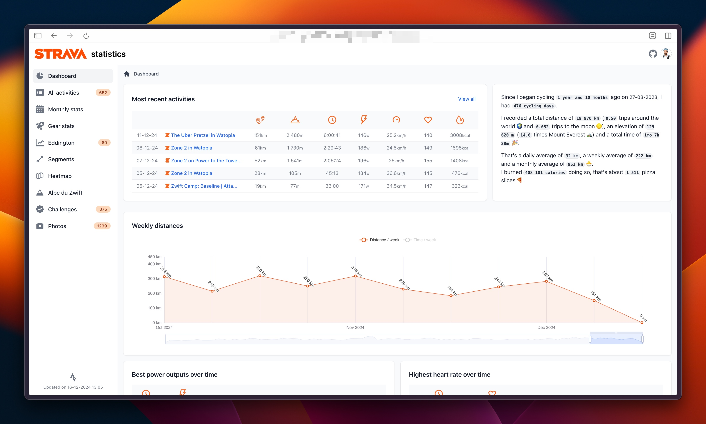

<p align="center">
    
</p>

---

Use this Docker image to set up your own Strava statistics pages. 
Only bike rides are taken into account.

## Prerequisites

You'll need a `Strava client ID`, `Strava client Secret` and a `refresh token`

* Next, navigate to your [Strava API settings page](https://www.strava.com/settings/api).
  Copy the `client ID` and `client secret`
* Now you need to obtain a `Strava API refresh token`. 
    * Navigate to https://developers.strava.com/docs/getting-started/#d-how-to-authenticate
      and scroll down to "_For demonstration purposes only, here is how to reproduce the graph above with cURL:_"
    * Follow the 11 steps explained there
    * Make sure you set the `scope` in step 2 to `activity:read_all` to make sure your refresh token has access to all activities

## Docker compose

`docker-compose.yml`

```yml
services:
  app:
    image: robiningelbrecht/strava-statistics:latest
    volumes:
      - ./build:/var/www/build
      - ./storage/database:/var/www/storage/database
      - ./storage/files:/var/www/storage/files
    env_file: ./.env
    ports:
      - 8080:8080
```

`.env`

```bash
# Leave this unchanged.
DATABASE_URL="sqlite:///%kernel.project_dir%/storage/database/strava.db?charset=utf8mb4"

# The client id of your Strava app.
STRAVA_CLIENT_ID=YOUR_CLIENT_ID
# The client secret of your Strava app.
STRAVA_CLIENT_SECRET=YOUR_CLIENT_SECRET
# The refresh of your Strava app.
STRAVA_REFRESH_TOKEN=YOUR_REFRESH_TOKEN

# Your birthday. Needed to calculate heart rate zones.
ATHLETE_BIRTHDAY=YYYY-MM-DD
# History of FTP. Needed to calculate relative w/kg.
FTP_VALUES='{
    "YYYY-MM-DD": 198,
    "YYYY-MM-DD": 220
}'
```

## Import and build statistics

```bash
docker compose exec app bin/console app:strava:import-data
docker compose exec app bin/console app:strava:build-files
```

## Periodic imports

You can configure a crontab on your host system:

```bash
0 18 * * * docker compose exec app bin/console app:strava:import-data && 
docker compose exec app bin/console app:strava:build-files
```

## Screenshots

