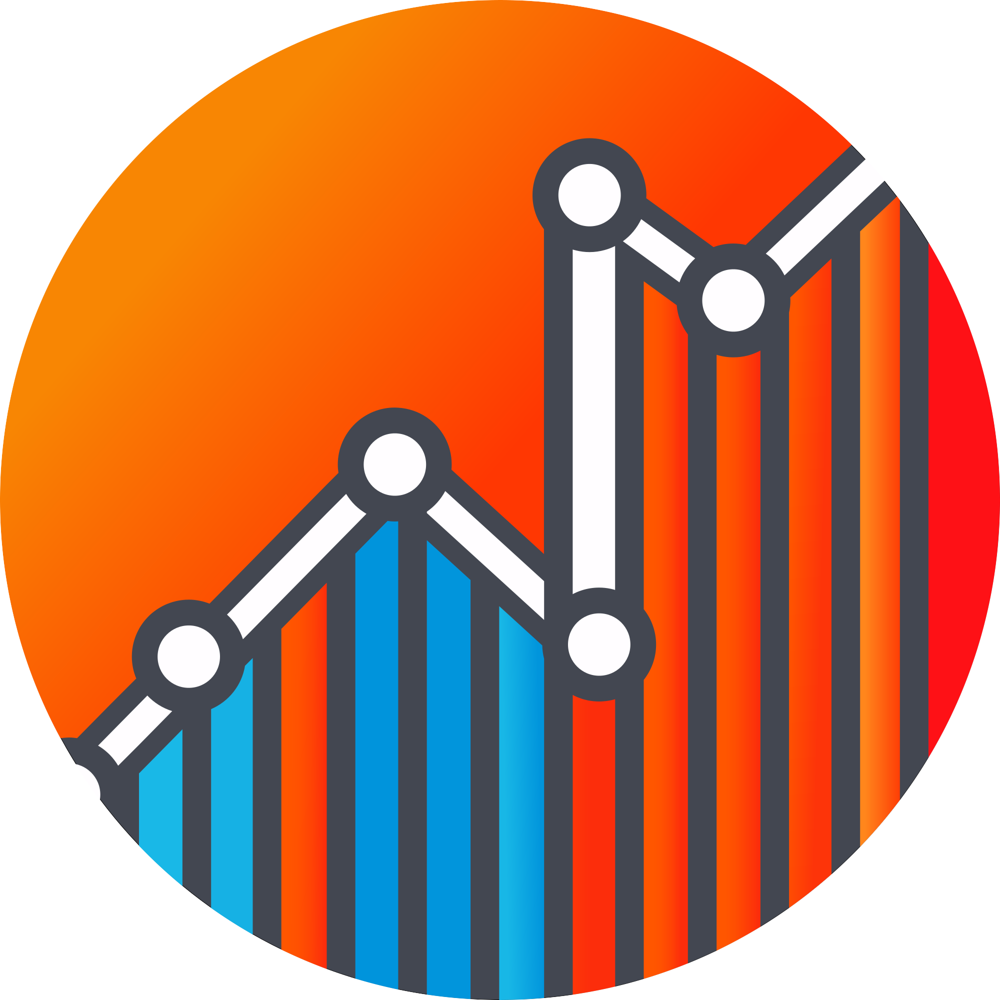

<p align="center">
  
</p>

<h1 align="center">Strava Statistics</h1>

<p align="center">
<a href="https://github.com/robiningelbrecht/strava-statistics/actions/workflows/ci.yml"></a>
<a href="https://github.com/robiningelbrecht/strava-statistics/actions/workflows/docker-image.yml"></a>
<a href="https://raw.githubusercontent.com/robiningelbrecht/strava-statistics/refs/heads/master/LICENSE"></a>
<a href="https://hub.docker.com/r/robiningelbrecht/strava-statistics"></a>
<a href="https://hub.docker.com/r/robiningelbrecht/strava-statistics"></a>
<a href="https://hub.docker.com/r/robiningelbrecht/strava-statistics"></a>
</p>

---

<h4 align="center">Strava Statistics is a self-hosted web app designed to provide you with better stats.</h4>

<p align="center">
  <a href="#-showcase">Showcase</a> •
  <a href="#%EF%B8%8F-disclaimer">Disclaimer</a> •
  <a href="#-wiki">Wiki</a> •
  <a href="#-prerequisites">Prerequisites</a> •
  <a href="#%EF%B8%8F-installation">Installation</a> •
  <a href="#%EF%B8%8Fimport-and-build-statistics">Import and build statistics</a> •
  <a href="#-periodic-imports">Periodic imports</a>
</p>


## 📸 Showcase

https://github.com/user-attachments/assets/a865f2f6-7f65-428b-9f00-1a8ff3e625c0

### Key Features

* Dashboard with various stats and charts
* Detailed list of all your activities
* Monthly stats with calendar view
* Gear stats
* Eddington for biking and running activities
* Detailed list of your segments and corresponding efforts
* Heatmap
* History of completed Strava challenges
* History of activity photos

## ⚠️ Disclaimer

* 🛠️ __Under active development__: Expect frequent updates, bugs, and breaking changes.
* 📦 __Backup before updates__: Always backup your Docker volumes before upgrading.
* 🔄 __Stay up-to-date__: Make sure you're running the latest version for the best experience.
* 🤓 __Check the release notes__: Always check the release notes to verify if there are any breaking changes.

## 📚 Wiki

Read [the wiki](https://github.com/robiningelbrecht/strava-statistics/wiki) before opening new issues. The question you have might be answered over there.

## 🪄 Prerequisites

You'll need a `Strava client ID`, `Strava client Secret` and a `refresh token`

* Navigate to your [Strava API settings page](https://www.strava.com/settings/api).
  Copy the `client ID` and `client secret`
* Next you need to obtain a `Strava API refresh token`. 
    * Navigate to https://developers.strava.com/docs/getting-started/#d-how-to-authenticate
      and scroll down to "_For demonstration purposes only, here is how to reproduce the graph above with cURL:_"
    * Follow the 11 steps explained there
    * Make sure you change the `&scope=read` to `&scope=activity:read_all` to make sure your refresh token has access to all activities

## 🛠️ Installation 

> [!NOTE]
> To run this application, you'll need [Docker](https://docs.docker.com/engine/install/) with [docker-compose](https://docs.docker.com/compose/install/).

Start off by showing some ❤️ and give this repo a star. Then from your command line:

```bash
# Create a new directory
> mkdir strava-statistics
> cd strava-statistics

# Create docker-compose.yml and copy the example contents into it
> touch docker-compose.yml
> nano docker-compose.yml

# Create .env and copy the example contents into it. Configure as you like
> touch .env
> nano .env
```

### docker-compose.yml

```yml
services:
  app:
    image: robiningelbrecht/strava-statistics:latest
    volumes:
      - ./build:/var/www/build
      - ./storage/database:/var/www/storage/database
      - ./storage/files:/var/www/storage/files
    env_file: ./.env
    ports:
      - 8080:8080
```

### .env

```bash
# The client id of your Strava app.
STRAVA_CLIENT_ID=YOUR_CLIENT_ID
# The client secret of your Strava app.
STRAVA_CLIENT_SECRET=YOUR_CLIENT_SECRET
# The refresh of your Strava app.
STRAVA_REFRESH_TOKEN=YOUR_REFRESH_TOKEN
# Strava API has rate limits (https://github.com/robiningelbrecht/strava-statistics/wiki),
# to make sure we don't hit the rate limit, we want to cap the number of new activities processed
# per import. Considering there's a 1000 request per day limit and importing one new activity can
# take up to 3 API calls, 250 should be a safe number.
NUMBER_OF_NEW_ACTIVITIES_TO_PROCESS_PER_IMPORT=250

# Allowed options: en_US or fr_FR
LOCALE=en_US
# Allowed options: metric or imperial
UNIT_SYSTEM=metric
# Time format to use when rendering the app
# Allowed formats: 24 or 12 (includes AM and PM)
TIME_FORMAT=24
# Date format to use when rendering the app
# Allowed formats: DAY-MONTH-YEAR or MONTH-DAY-YEAR
DATE_FORMAT=DAY-MONTH-YEAR
# Sport types to import. Leave empty to import all sport types
# With this list you can also decide the order the sport types will be rendered in.
# A full list of allowed options is available on https://github.com/robiningelbrecht/strava-statistics/wiki/Supported-sport-types/
SPORT_TYPES_TO_IMPORT='[]'
# Your birthday. Needed to calculate heart rate zones.
ATHLETE_BIRTHDAY=YYYY-MM-DD
# History of weight (in kg or pounds, depending on UNIT_SYSTEM). Needed to calculate relative w/kg.
# Check https://github.com/robiningelbrecht/strava-statistics/wiki for more info.
ATHLETE_WEIGHTS='{
    "YYYY-MM-DD": 74.6,
    "YYYY-MM-DD": 70.3
}'
# History of FTP. Needed to calculate activity stress level.
# Check https://github.com/robiningelbrecht/strava-statistics/wiki for more info.
FTP_VALUES='{
    "YYYY-MM-DD": 198,
    "YYYY-MM-DD": 220
}'
# Full URL with ntfy topic included. This topic will be used to notify you when a new HTML build has run.
# Leave empty to disable notifications.
NTFY_URL=''
# An array of activity ids to skip during import. 
# This allows you to skip specific activities during import.
# ACTIVITIES_TO_SKIP_DURING_IMPORT='["123456", "654321"]'
```

### Importing challenges and trophies

> [!IMPORTANT]
> Only visible challenges on your public profile can be imported. Please make sure that your profile is public,
> otherwise the app won't be able to import them

#### Importing complete history

Strava does not allow to fetch a complete history of your completed challenges and trophies.
There's a little workaround if you'd still like to import these:
* Navigate to https://www.strava.com/athletes/[YOUR_ATHLETE_ID]/trophy-case
* Open the page's source code and copy everything
  
* Make sure you save the source code to the file `./storage/files/strava-challenge-history.html`
* On the next import, all your challenges will be imported

## ⚡️Import and build statistics

```bash
docker compose exec app bin/console app:strava:import-data
docker compose exec app bin/console app:strava:build-files
```

## ⏰ Periodic imports

The wiki explains [how to schedule imports](https://github.com/robiningelbrecht/strava-statistics/wiki/Scheduling-automatic-imports)

## 🗺️ New locales and translations

If you want to see a new locale added, please  [open a new issue](https://github.com/robiningelbrecht/strava-statistics/issues/new/choose). 
Only do this if you are willing to help on the actual translation 🙃.

## 💡 Feature request?

For any feedback, help or feature requests, please [open a new issue](https://github.com/robiningelbrecht/strava-statistics/issues/new/choose). 
Before you do, please read [the wiki](https://github.com/robiningelbrecht/strava-statistics/wiki). The question you have might be answered over there.
