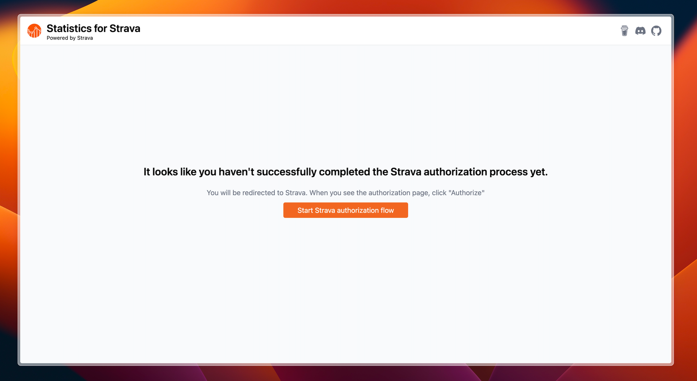

<p align="center">
  
</p>

<h1 align="center">Statistics for Strava</h1>

<p align="center">
<a href="https://github.com/robiningelbrecht/statistics-for-strava/actions/workflows/ci.yml"></a>
<a href="https://github.com/robiningelbrecht/statistics-for-strava/actions/workflows/docker-image.yml"></a>
<a href="https://raw.githubusercontent.com/robiningelbrecht/statistics-for-strava/refs/heads/master/LICENSE"></a>
<a href="https://hub.docker.com/r/robiningelbrecht/strava-statistics"></a>
<a href="https://hub.docker.com/r/robiningelbrecht/strava-statistics"></a>
<a href="https://hub.docker.com/r/robiningelbrecht/strava-statistics"></a>
<a href="https://discord.gg/p4zpZyCHNc"></a>  
</p>

---

<h4 align="center">Statistics for Strava is a self-hosted web app designed to provide you with better stats.</h4>

<p align="center">
  <a href="#-showcase">Showcase</a> •
  <a href="#%EF%B8%8F-disclaimer">Disclaimer</a> •
  <a href="#-wiki">Wiki</a> •
  <a href="#-prerequisites">Prerequisites</a> •
  <a href="#%EF%B8%8F-installation">Installation</a> •
  <a href="#%EF%B8%8Fimport-and-build-statistics">Import and build statistics</a> •
  <a href="#%EF%B8%8F-locales-and-translations">Locales and translations</a> •
  <a href="https://discord.gg/p4zpZyCHNc">Discord</a> •
  <a href="#%EF%B8%8F-sponsors">Sponsors</a>
</p>

<p align="center">
  <a href="https://www.buymeacoffee.com/ingelbrecht" target="_blank"></a>
</p>

## 📸 Showcase

> [!NOTE]
> This app is in no way affiliated with or part of the official Strava software suite.

https://github.com/user-attachments/assets/b7d447b1-0212-49c8-ac67-62d737c66922

### Key Features

* Dashboard with various stats and charts
* Detailed list of all your activities
* Monthly stats with calendar view
* Gear stats
* Custom gears ([instructions](https://github.com/robiningelbrecht/statistics-for-strava/wiki/Custom-Gear))
* Gear (component) maintenance tracking ([instructions](https://github.com/robiningelbrecht/statistics-for-strava/wiki/Gear-maintenance))
* Eddington for biking and running activities
* Detailed list of your segments and corresponding efforts
* Heatmap
* Strava Rewind, a fun way to look back on your year in motion
* History of completed Strava challenges
* History of activity photos
* User badges
* PWA support

## ⚠️ Disclaimer

* 📦 __Backup before updates__: Always backup your Docker volumes before upgrading.
* 🔄 __Stay up-to-date__: Make sure you're running the latest version for the best experience.
* 🤓 __Check the release notes__: Always check the release notes to verify if there are any breaking changes.

## 📚 Wiki

Read [the wiki](https://github.com/robiningelbrecht/statistics-for-strava/wiki) before opening new issues. The question you have might be answered over there.

## 🪄 Prerequisites

You'll need a `Strava client ID` and `Strava client Secret`

* Navigate to your [Strava API settings page](https://www.strava.com/settings/api).
* Copy the `client ID` and `client secret`, you'll need these during the [installation](#%EF%B8%8F-installation)
* Make sure the `Authorization App Domain` is set to the url you will host your app on. By default this should be `http://localhost:8080`

## 🛠️ Installation 

> [!NOTE]
> To run this application, you'll need [Docker](https://docs.docker.com/engine/install/) with [docker-compose](https://docs.docker.com/compose/install/).

Start off by showing some ❤️ and give this repo a star. Then from your command line:

```bash
# Create a new directory
> mkdir statistics-for-strava
> cd statistics-for-strava

# Create docker-compose.yml and copy the example contents into it
> touch docker-compose.yml
> nano docker-compose.yml

# Create .env and copy the example contents into it. Configure as you see fit
> touch .env
> nano .env

# Create config.yaml and copy the example contents into it. Configure as you see fit
> touch config/config.yaml
> nano config/config.yaml
```

### docker-compose.yml

```yml
services:
  app:
    image: robiningelbrecht/strava-statistics:latest
    container_name: statistics-for-strava
    restart: unless-stopped
    volumes:
      - ./config:/var/www/config/app
      - ./build:/var/www/build
      - ./storage/database:/var/www/storage/database
      - ./storage/files:/var/www/storage/files
    env_file: ./.env
    ports:
      - 8080:8080
```

### .env

> [!IMPORTANT]
> Every time you change the .env file, you need to restart your container for the changes to take effect.

```bash
# Every time you change the .env file, you need to restart your container for the changes to take effect.

# The client id of your Strava app.
STRAVA_CLIENT_ID=YOUR_CLIENT_ID
# The client secret of your Strava app.
STRAVA_CLIENT_SECRET=YOUR_CLIENT_SECRET
# You will need to obtain this token the first time you launch the app. 
# Leave this unchanged for now until the app tells you otherwise.
# Do not use the refresh token displayed on your Strava API settings page, it will not work.
STRAVA_REFRESH_TOKEN=YOUR_REFRESH_TOKEN_OBTAINED_AFTER_AUTH_FLOW
# The schedule to periodically run the import and HTML builds. Leave empty to disable periodic imports.
# The default schedule runs once a day at 04:05. If you do not know what cron expressions are, please leave this unchanged
# Make sure you don't run the imports too much to avoid hitting the Strava API rate limit. Once a day should be enough.
IMPORT_AND_BUILD_SCHEDULE="5 4 * * *"
# Valid timezones can found under TZ Identifier column here: https://en.wikipedia.org/wiki/List_of_tz_database_time_zones#List
TZ=Etc/GMT

# The UID and GID to create/own files managed by statistics-for-strava
# May only be necessary on Linux hosts, see File Permissions in Wiki
#PUID=
#PGID=
```

### config.yaml

```yaml
general:
  # The URL on which the app will be hosted. This URL will be used in the manifest file. 
  # This will allow you to install the web app as a native app on your device.
  appUrl: 'http://localhost:8080/'
  # Optional, a link to your profile picture. Will be used to display in the nav bar and link to your Strava profile.
  # Leave empty to disable this feature.
  profilePictureUrl: null
  # Optional, full URL with ntfy topic included. This topic will be used to notify you when a new HTML build has run.
  # Leave empty to disable notifications.
  ntfyUrl: null
  athlete:
    # Your birthday. Needed to calculate heart rate zones.
    birthday: 'YYYY-MM-DD'
    # The formula used to calculate your max heart rate. The default is Fox (220 - age).
    # Allowed values: arena, astrand, fox, gellish, nes, tanaka (https://pmc.ncbi.nlm.nih.gov/articles/PMC7523886/table/t2-ijes-13-7-1242/)
    # Or you can set a fixed number for any given date range.  
    maxHeartRateFormula: 'fox'
    # maxHeartRateFormula:
    #    "2020-01-01": 198
    #    "2025-01-10": 193
    # History of weight (in kg or pounds, depending on appearance.unitSystem). Needed to calculate relative w/kg.
    # Check https://github.com/robiningelbrecht/statistics-for-strava/wiki for more info.
    weightHistory:
      "YYYY-MM-DD": 100
      "YYYY-MM-DD": 200
    # Optional, history of FTP. Needed to calculate activity stress level.
    # Check https://github.com/robiningelbrecht/statistics-for-strava/wiki for more info. Example:
    # ftpHistory
    #    "2024-10-03": 198
    #    "2025-01-10": 220
    #
    ftpHistory: []
appearance:
  # Allowed options: en_US, fr_FR, nl_BE, de_DE, pt_BR, pt_PT or zh_CN
  locale: 'en_US'
  # Allowed options: metric or imperial
  unitSystem: 'metric'
  # Time format to use when rendering the app
  # Allowed formats: 24 or 12 (includes AM and PM)
  timeFormat: 24
  # Date format to use when rendering the app
  # Allowed formats: DAY-MONTH-YEAR or MONTH-DAY-YEAR
  dateFormat: 'DAY-MONTH-YEAR'
import:
  # Strava API has rate limits (https://github.com/robiningelbrecht/statistics-for-strava/wiki),
  # to make sure we don't hit the rate limit, we want to cap the number of new activities processed
  # per import. Considering there's a 1000 request per day limit and importing one new activity can
  # take up to 3 API calls, 250 should be a safe number.
  numberOfNewActivitiesToProcessPerImport: 250
  # Sport types to import. Leave empty to import all sport types
  # With this list you can also decide the order the sport types will be rendered in.
  # A full list of allowed options is available on https://github.com/robiningelbrecht/statistics-for-strava/wiki/Supported-sport-types/
  sportTypesToImport: []
  # Activity visibilities to import. Leave empty to import all visibilities
  # This list can be combined with sportTypesToImport.
  # Allowed values: ["everyone", "followers_only", "only_me"]
  activityVisibilitiesToImport: []
  # Optional, the date (YYYY-MM-DD) from which you want to start importing activities. 
  # Any activity recorded before this date, will not be imported.
  # This can be used if you want to skip the import of older activities. Leave empty to disable.
  skipActivitiesRecordedBefore: null
  # An array of activity ids to skip during import. 
  # This allows you to skip specific activities during import.
  # ["123456789", "987654321"]
  activitiesToSkipDuringImport: []
zwift:
  # Optional, your Zwift level (1 - 100). Will be used to render your Zwift badge. Leave empty to disable this feature
  level: null
  # Optional, your Zwift racing score (0 - 1000). Will be used to add to your Zwift badge if zwift.level is filled out.
  racingScore: null
```

### Running the Application

To run the application run the following command:

```bash
> docker compose up
```

The docker container is now running; navigate to `http://localhost:8080/` to access the app.

> [!IMPORTANT]
> Make sure to edit the `.env` file to include your `Strava client ID` and `Strava client Secret`

### Obtaining a Strava refresh token

The first time you launch the app, you will need to obtain a `Strava refresh token`.
The app needs this token to be able to access your data and import it into your local database.

Navigate to http://localhost:8080/. 
You should see this page—just follow the steps to complete the setup.



### Importing challenges and trophies

> [!IMPORTANT]
> Only visible challenges on your public profile can be imported. Please make sure that your profile is public,
> otherwise the app won't be able to import them

#### Importing complete history

Strava does not allow to fetch a complete history of your completed challenges and trophies.
There's a little workaround if you'd still like to import these:
* Navigate to https://www.strava.com/athletes/[YOUR_ATHLETE_ID]/trophy-case
* Open the page's source code and copy everything
  
* Make sure you save the source code to the file `./storage/files/strava-challenge-history.html`
* On the next import, all your challenges will be imported

> [!WARNING]
> Make sure before you save the source code, your Strava account is set to be translated in English.
> The app can only handle this export in English for now.

## ⚡️Import and build statistics

```bash
docker compose exec app bin/console app:strava:import-data
docker compose exec app bin/console app:strava:build-files
```

## 🗺️ Locales and translations

Currently, the app is translated to:

* 🇬🇧 English
* 🇫🇷 French (thanks to [@llaumgui](https://github.com/llaumgui) and [@Ahmosys](https://github.com/llaumgui))
* 🇩🇪 German (thanks to [@daydreamer77](https://github.com/daydreamer77))
* 🇧🇪 Dutch
* 🇵🇹 Portuguese (thanks to [@jcnmsg](https://github.com/jcnmsg) & [@davisenra](https://github.com/davisenra))
* 🇨🇳 Simplified Chinese (thanks to [@c0j0s](https://github.com/c0j0s))

If you want to see a new locale added, please  [open a new issue](https://github.com/robiningelbrecht/statistics-for-strava/issues/new?template=translations-and-localisation.md). 
Only do this if you are willing to help on the actual translation 🙃.

## 💡 Feature request?

For any feedback, help or feature requests, please [open a new issue](https://github.com/robiningelbrecht/statistics-for-strava/issues/new/choose). 
Before you do, please read [the wiki](https://github.com/robiningelbrecht/statistics-for-strava/wiki). The question you have might be answered over there.

## 🛠️ Local setup

Run the following commands to setup the project on your local machine

```bash
> git clone git@github.com:your-name/your-fork.git
> make composer arg="install --no-scripts"
> make up
```

Everytime you make changes to the app, you need to build the html files again

```bash
> make console arg="app:strava:build-files"
```

## ❤️ Sponsors

This project is sponsored by [Blackfire.io](https://www.blackfire.io).


